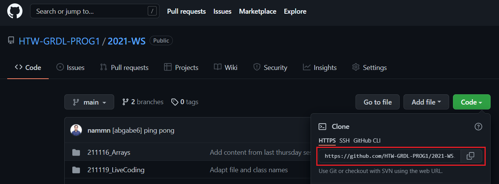
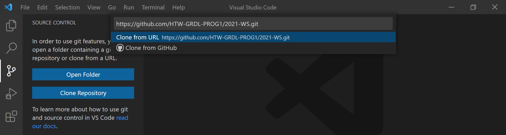

# How to use (Git) Source Control in VS Code

For a full tutorial please visit: https://code.visualstudio.com/Docs/editor/versioncontrol

## Prerequisites
 1. [Install Git](https://git-scm.com/download)
 2. [Install VS Code](https://code.visualstudio.com/docs/languages/java)

## The typical Git workflow

Once the prerequisites are met, open VS Code. Click on the Source control view (`Ctrl+Shift+G`) that can be found on the left side of the screen. Now you can either open an existing repository from your drive or clone a repository from the internet.

### Cloning an existing GitHub Repository

A repository is (very) basically a shared folder that allows multiple persons to work on the same programming project at the same time. To clone (copy) an existing repository, we need an URL. In the case of GitHub repositories, the URL can be found in the top-right corner of the repositories' page. 

Copy the URL and go back to VS Code. In the Source Control view of VS Code click on **Clone Repository**, paste the URL and hit enter.

You will now be prompted for a location where the repository is going to be stored. Now the contents of the remote repository will be copied to your filesystem.

### Making changes

The Source Control will register any changes that are made to the repository or the existing code.